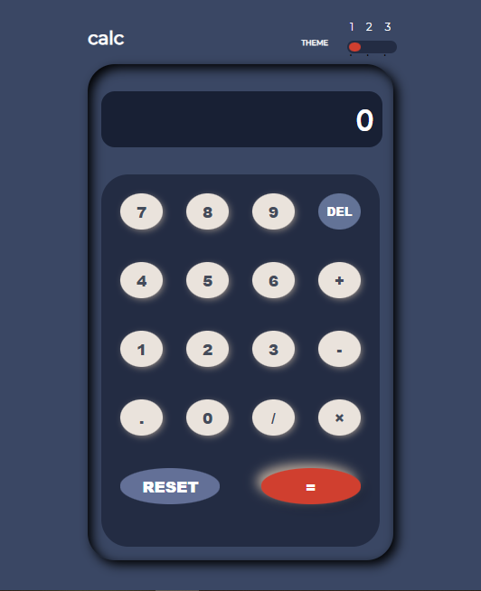
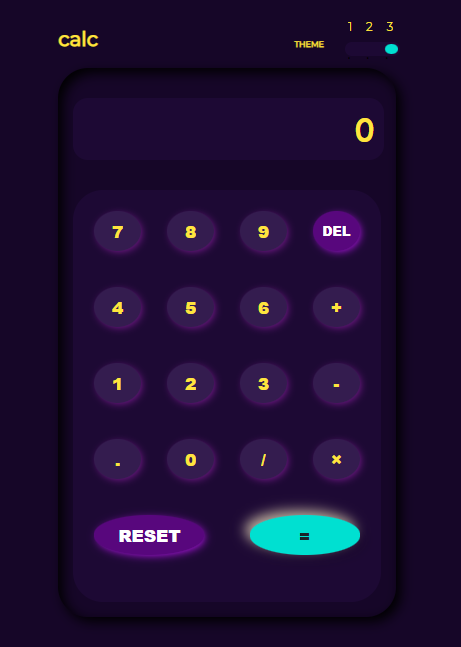

# Frontend Mentor - Calculator app solution

This is a solution to the [Calculator app challenge on Frontend Mentor](https://www.frontendmentor.io/challenges/calculator-app-9lteq5N29). with dark mode feature.

## Table of contents

- [Overview](#overview)
  - [The challenge](#the-challenge)
  - [Screenshot](#screenshot)
  - [Links](#links)
- [My process](#my-process)
  - [Built with](#built-with)
  - [What I learned](#what-i-learned)
  - [Continued development](#continued-development)
  - [Useful resources](#useful-resources)
- [Author](#author)
- [Acknowledgments](#acknowledgments)

## Overview

### The challenge

Users should be able to:

- See the size of the elements adjust based on their device's screen size
- Perform mathmatical operations like addition, subtraction, multiplication, and division
- Adjust the color theme based on their preference

### Screenshot




### Links

- Solution URL: [Add solution URL here](https://github.com/faozziyyah/js-calculator)
- Live Site URL: [Add live site URL here](https://faozziyyah.github.io/js-calculator/)

## My process

### Built with

- Semantic HTML5 markup
- CSS custom properties
- Flexbox
- CSS Grid
- Mobile-first workflow

### What I learned
```html
<h1>HTML layout of a calculator</h1>
 <button type="button" class="operator" value="-">-</button>

	  <button type="button" class="operator" value="*">&times;</button>

	  <button type="button" class="operator" value="/">&divide;</button>
	  
	  <button type="button" value="7">7</button>
	  <button type="button" value="8">8</button>
	  <button type="button" value="9">9</button>
```
```css
.calculator-keys {
  display: grid;
  grid-template-columns: 1fr 1fr 1fr 1fr;
  grid-gap: 20px;
  padding: 20px;
}
```
```js
const calculator = {
  displayValue: '0',
  firstOperand: null,
  waitingForSecondOperand: false,
  operator: null,
};

  console.log('🎉')
```

### Continued development
- sin, cos, tan functionality

### Useful resources

- [CSS grid](https://freshman.tech/css-grid-calculator/) - This helped me with CSS grid. I really liked this pattern and it's explanatory.
- [Js calculator resources](https://freshman.tech/calculator/) - This is an amazing article which helped me finally understand javascript calculator. I'd recommend it to anyone still learning this concept.

## Author

- Website - [Faozziyyah](https://resume-cv-xi.vercel.app/)
- Frontend Mentor - [@faozziyyah](https://www.frontendmentor.io/profile/faozziyyah)
- Twitter - [@muslimahdev](https://www.twitter.com/muslimahdev?s=08)

